# Figure Gallery

Every figure in the thesis, what it shows, and how to read it.

Generated by two scripts:

```bash
python make_diagrams.py    # Chapters I–III — conceptual and methodological
python make_figures.py     # Chapter IV    — data plots from results/tables
```

Both write **PNG** (300 dpi, for Word) and **PDF** (vector, for LaTeX) into
`results/figures/`. Missing inputs are skipped with a note rather than
crashing, so either script is safe to run at any stage.

---

## Design conventions

Applied consistently across all 18 figures so the reader learns the visual
language once.

**One colour per model, everywhere.** A reader who learns that
<code>&#9632;</code> dark red is DecisionTree in Figure 4.4 does not have to
relearn it in Figure 4.9.

| | model | role |
|---|---|---|
| `#c1440e` | DecisionTree | detection |
| `#e08214` | GaussianNB | RQ1 control |
| `#b8a02e` | LogisticRegression | RQ1 control |
| `#4a8c5f` | XGBoost | detection |
| `#2b7a9e` | MLP | RQ1 control |
| `#3d4f8f` | RandomForest | detection |

**One colour per explainer.** LIME blue, SHAP green, Permutation orange,
TOPSIS gold, and **Random always grey and dashed** — the control should read
as a reference line, never as a competitor.

**Red marks the thing that must not be missed.** The frozen-model box, the
leakage boundary, the "no better than random" line, the n=33 warning on Worms.

**No chartjunk.** No 3-D, no gradients, no drop shadows, top and right spines
removed, grid at 25% opacity.

**No pie chart.** At 96.2% Benign a pie is one slice and nine slivers, and it
cannot show the uncertainty that matters for the rare classes. Figure 4.1 uses
a log-scale horizontal bar instead.

---

# Chapter I — Introduction

### Figure 1.1 — The trust gap

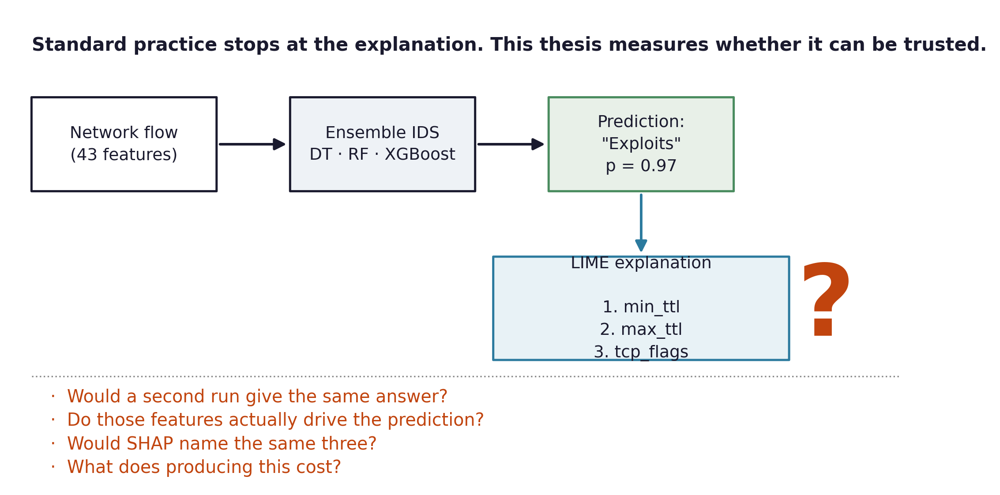

**What it shows.** A flow enters, the ensemble flags it as Exploits with
p = 0.97, LIME names three features — and then the diagram stops and asks four
questions nobody in this literature answers.

**Why it is first.** It states the problem in one image before any technical
material. The four questions map one-to-one onto RQ1, RQ2, RQ4 and the cost
accounting, so the reader knows the shape of the whole thesis from page one.

**How to read it.** The red question mark is the argument: the pipeline above
it is standard practice, and everything below it is this thesis.

---

# Chapter II — Literature Review

### Figure 2.1 — Position against prior art

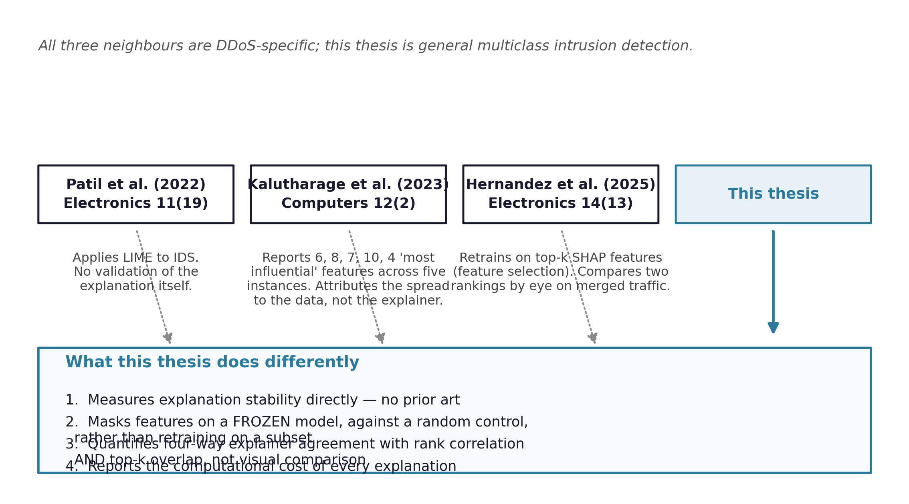

**What it shows.** The three closest papers across the top, what each actually
did beneath them, and the four ways this thesis differs in the panel below.

**Why it matters more than it looks.** The roadmap identifies failing to cite
Kalutharage et al. (2023) and Hernandez et al. (2025) as *the single largest
examination risk in this project*. An examiner who finds Hernandez
independently and does not see it in your Related Work will conclude you
rediscovered their result. This figure makes the differentiation impossible to
miss.

**The key distinction to be able to say aloud.** Hernandez et al. retrain on
top-k SHAP features and call it faithfulness. Retraining measures whether
those features *suffice to build a model*; it cannot measure whether the
original model *used* them, because a retrained model recovers performance
from correlated substitutes.

---

# Chapter III — Methodology

### Figure 3.1 — System architecture

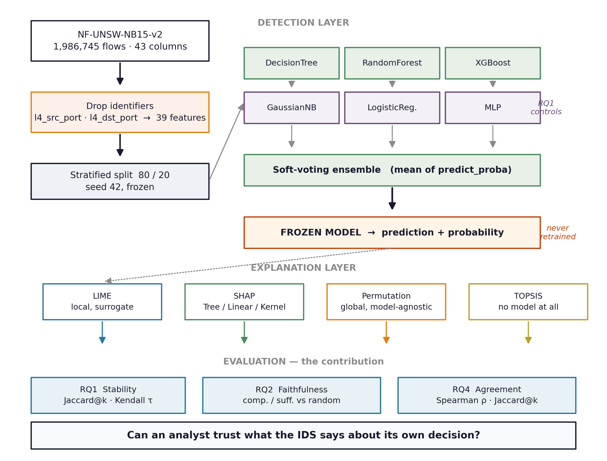

**The single most important figure in the document.** Examiners look for it
first, and its absence is noticed before anything else is read. Place it early
in Chapter III and reference it from the Introduction.

**How to read it.** Four bands, top to bottom:

1. **Data** (left column) — 1,986,745 flows, identifiers dropped to 39
   features, split 80/20 at seed 42.
2. **Detection** — three tree models in green, three non-tree RQ1 controls in
   purple, combined by soft voting.
3. **Frozen model** (red) — the pivot of the entire design. Nothing downstream
   retrains.
4. **Explanation and evaluation** — four rankers feed three research questions.

**The detail to point at in a viva.** The purple row is labelled *RQ1
controls*, not baselines. GaussianNB has a 44.8% false alarm rate and is not a
working detector; it exists so the RQ1 comparison is not confined to one model
family.

### Figure 3.2 — RQ1 protocol

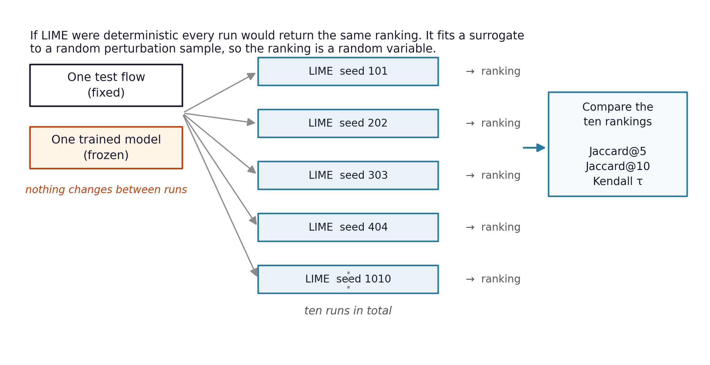

**What it shows.** One flow, one frozen model, ten LIME runs under different
seeds, ten rankings compared.

**The point it must convey.** Nothing changes between runs. If LIME were
deterministic all ten rankings would be identical. It fits a local surrogate to
a *random perturbation sample*, so the ranking is a random variable — and this
figure is what makes that intuitive to a reader who has only seen LIME used,
never questioned.

### Figure 3.3 — RQ2 protocol

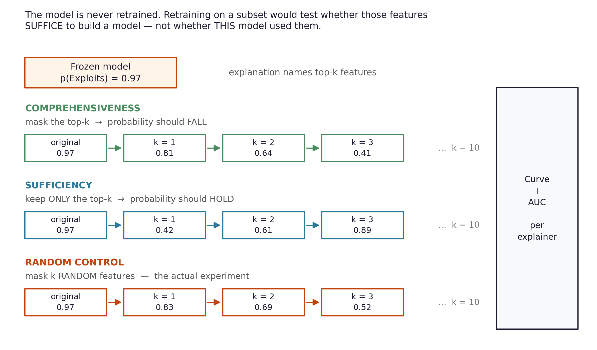

**What it shows.** Three parallel tracks on the same frozen model:
comprehensiveness (mask the top-k, probability should fall), sufficiency (keep
only the top-k, probability should hold), and the random control.

**Why the third row is red.** The random baseline is not a robustness check —
it is the experiment. Masking ten random features already drops the predicted
probability by about 0.32. Without that number, LIME's 0.55 looks impressive;
with it, LIME is 1.74× better than chance.

**The banner at the top** states the distinction from Hernandez et al. in two
lines. Worth reproducing verbatim in the text.

### Figure 3.4 — Experimental design

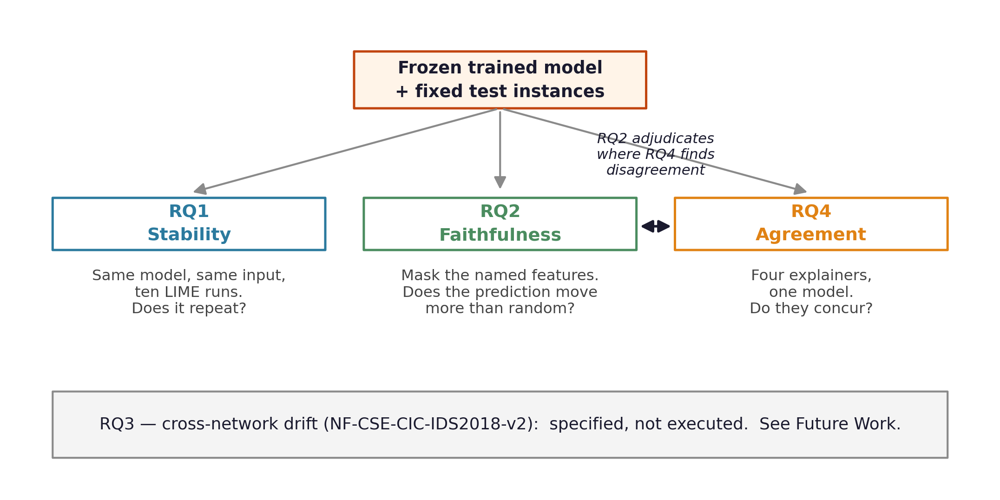

**What it shows.** How the three executed research questions hang off the same
frozen model, and the double-headed arrow between RQ2 and RQ4.

**The interesting relationship.** Where RQ4 finds two explainers disagreeing,
RQ2's faithfulness curves adjudicate which one better reflects actual model
behaviour. That chaining is what makes the design more than four separate
measurements.

**Bottom band.** RQ3 is shown greyed out and explicitly labelled *specified,
not executed*. Declaring scope in the design figure is stronger than leaving
the reader to notice the gap.

### Figure 3.5 — Preprocessing pipeline

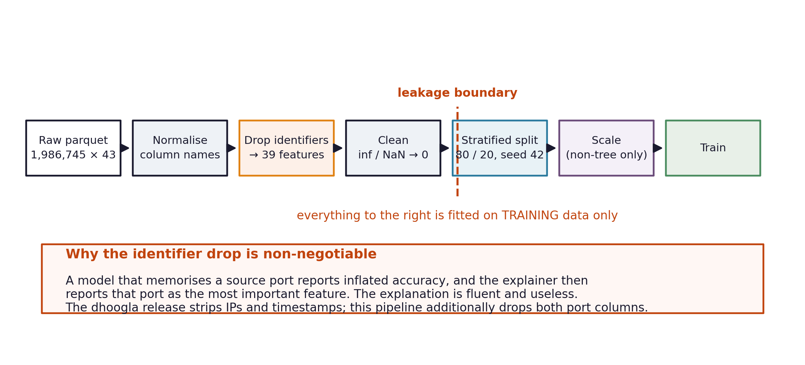

**What it shows.** Seven stages from raw parquet to training, with a red dashed
**leakage boundary**: everything to its right is fitted on training data only.

**The panel below** explains why dropping the port columns is non-negotiable. A
model that memorises a source port reports inflated accuracy, and the explainer
then reports that port as the most important feature — a fluent, useless
explanation. This single failure mode would invalidate every explanation
chapter.

---

# Chapter IV — Results and Discussion

### Figure 4.1 — Class distribution

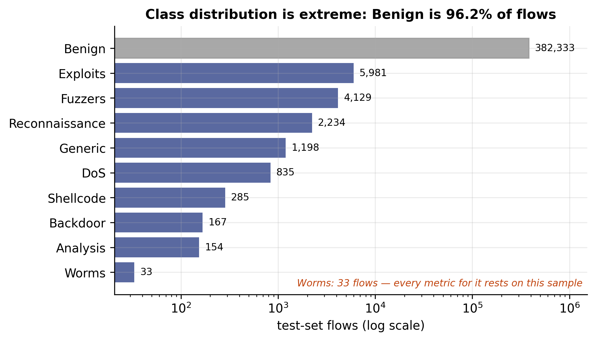

**What it shows.** Test-set support per class on a log axis. Benign is greyed
out at 382,333 flows; Worms sits at 33.

**Why log scale.** On a linear axis the nine attack classes are invisible. The
red annotation on Worms is a standing caveat: every Worms metric in this thesis
rests on 33 instances, and a 95% interval around its 0.939 recall spans roughly
0.80–0.98.

**This figure justifies macro-F1.** An always-Benign classifier scores 96.2%
accuracy while detecting nothing.

### Figure 4.2 — Detection performance

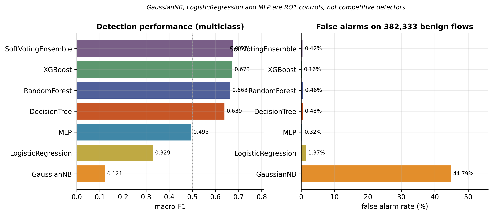

**What it shows.** macro-F1 and false alarm rate for all six models plus the
ensemble.

**Read the right panel carefully.** GaussianNB's 44.79% FAR is not a plotting
error — it flags nearly half of all benign traffic. The italic subtitle states
that three models are controls, without which a reader sees 0.121 and assumes a
mistake.

**The finding to write up.** The six-model soft-voting ensemble reached 0.6743,
edging past XGBoost's 0.6731, with FAR still 0.42% — probability averaging
absorbed a catastrophically broken member.

### Figure 4.3 — Per-class performance

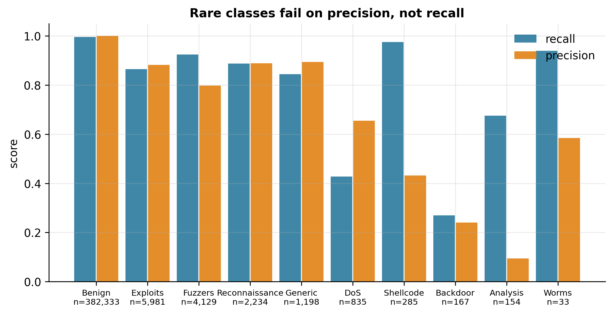

**What it shows.** Recall and precision side by side, ordered by support, with
n printed under each class.

**The pattern.** Rare classes fail on **precision**, not recall. Worms recall
0.939 but precision 0.585; Shellcode 0.975 and 0.432. `class_weight="balanced"`
is aggressively over-predicting rare classes to catch them — a trade, and one
worth naming.

### Figure 4.4 — RQ1 stability by model

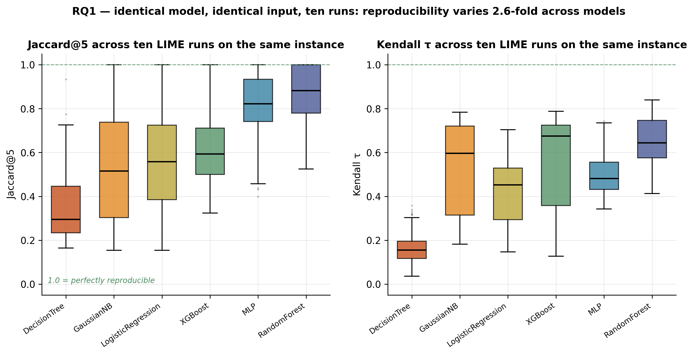

**The headline figure for RQ1.** Box plots of Jaccard@5 and Kendall τ across
933 instances per model, ordered by stability.

**How to read it.** The green dashed line at 1.0 is perfect reproducibility.
Each box summarises ten LIME runs on an identical model and an identical input.
DecisionTree's median sits near 0.34: two runs share barely a third of their
top-5 features.

**The spread is the result.** 0.337 to 0.868 — a 2.6-fold difference in
reproducibility with nothing changed but the model.

**Note the two panels disagree on ordering.** MLP is 2nd on Jaccard@5 but 4th
on Kendall τ. Top-k overlap and rank correlation are not interchangeable.

### Figure 4.5 — RQ1 by attack class

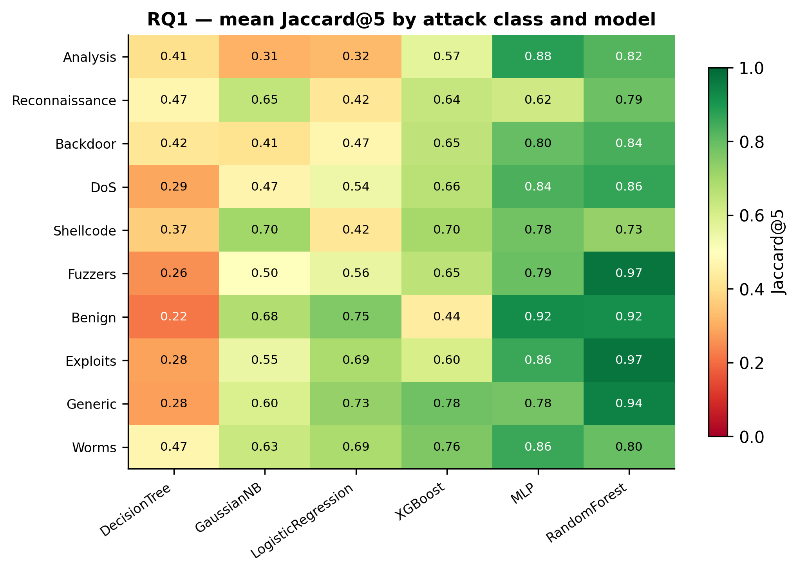

**What it shows.** Mean Jaccard@5 for every class × model combination, red-to-
green, rows sorted by mean.

**What to look for.** Whether instability is uniform across attack types or
concentrated. Read rows for class effects, columns for model effects — and note
that the two do not decompose cleanly, which is itself the point.

### Figure 4.6 — Four falsified mechanisms

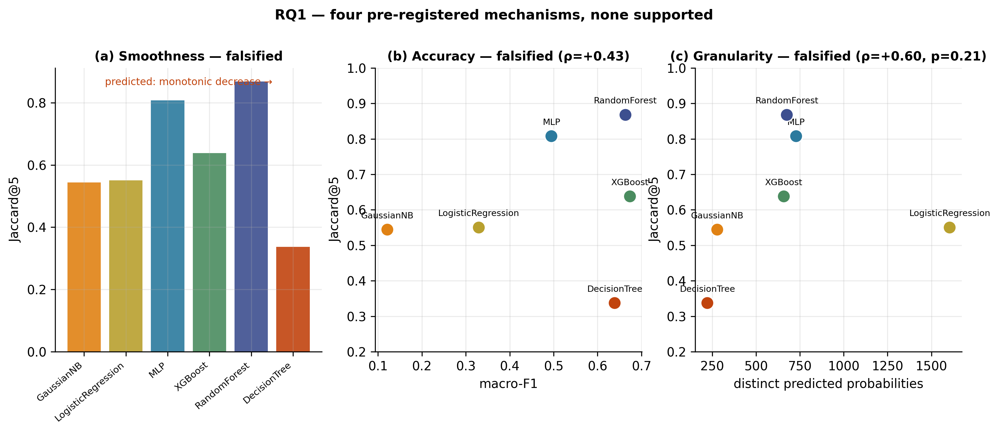

**The most intellectually honest figure in the thesis, and argue that it is a
strength.**

Three panels, three failed explanations:

- **(a) Smoothness** — predicted a monotonic decrease along the axis.
  LogisticRegression, a globally linear model where LIME's linear surrogate
  should fit perfectly, ranks **fifth of six**.
- **(b) Accuracy** — GaussianNB (macro-F1 0.121) and LogisticRegression (0.329)
  have near-identical stability at ~0.55.
- **(c) Granularity** — ρ = 0.60, p = 0.21. LogisticRegression emits 1,604
  distinct probabilities against DecisionTree's 221, yet is second-worst.

**Why include failures.** Each prediction was registered before the run. Four
documented falsifications demonstrate you tested your own explanation and
reported when it failed. A tidy causal story from six models would be
over-claiming, and an examiner would probe it.

### Figure 4.7 — RQ2 comprehensiveness curves

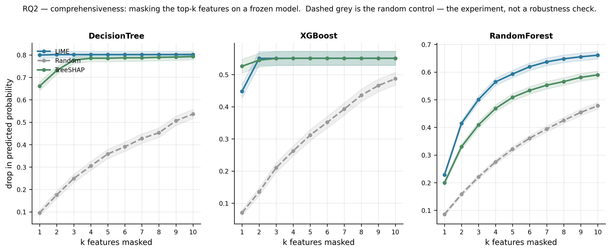

**What it shows.** Drop in predicted probability as k features are masked,
k = 1…10, one panel per model, shaded bands showing standard error.

**Read the gap, not the line.** The dashed grey Random curve is the reference.
The vertical distance between LIME and Random *is* the faithfulness result. If
the curves overlapped, LIME would be telling an analyst nothing.

### Figure 4.8 — Faithfulness relative to random

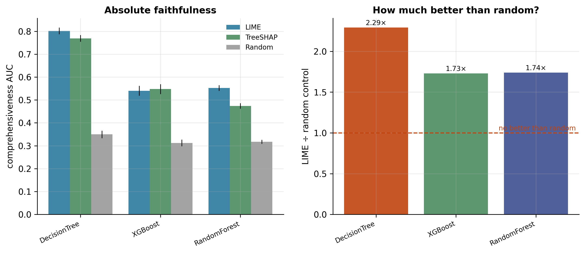

**What it shows.** Left: absolute comprehensiveness AUC per explainer with
error bars. Right: LIME divided by its random control, with a red line at 1.0
labelled *no better than random*.

**The numbers.** DecisionTree 2.29×, XGBoost 1.73×, RandomForest 1.74×, all at
Wilcoxon p < 1e-46. LIME is genuinely identifying features the model uses — the
question RQ1 raises is whether it identifies the *same* ones twice.

### Figure 4.9 — Stability against faithfulness

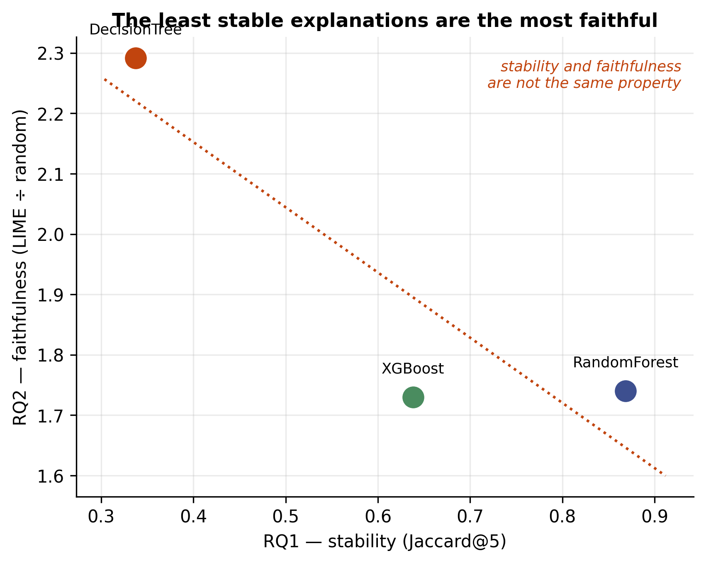

**The central result of the thesis. Use this slide in the defence.**

**What it shows.** RQ1 on the x-axis, RQ2 on the y-axis, one point per model.
The trend runs **downward**: the least stable explanations are the most
faithful. DecisionTree sits bottom-left on stability and top on faithfulness.

**What it means.** Stability and faithfulness are not the same property and can
move in opposite directions. An explainer validated on either one alone has not
been validated.

**A candidate reading, offered as a question rather than a conclusion.** A
short tree routes each instance through a handful of features; masking any of
them jumps the instance to a different leaf, so comprehensiveness is high for
anything that finds a used feature. That same flat-with-cliffs surface gives the
surrogate no gradient, so *which* features it names varies. Different runs find
different members of a redundant set, each individually sufficient to break the
prediction — local faithfulness without global validity.

### Figure 4.10 — RQ4 explainer agreement

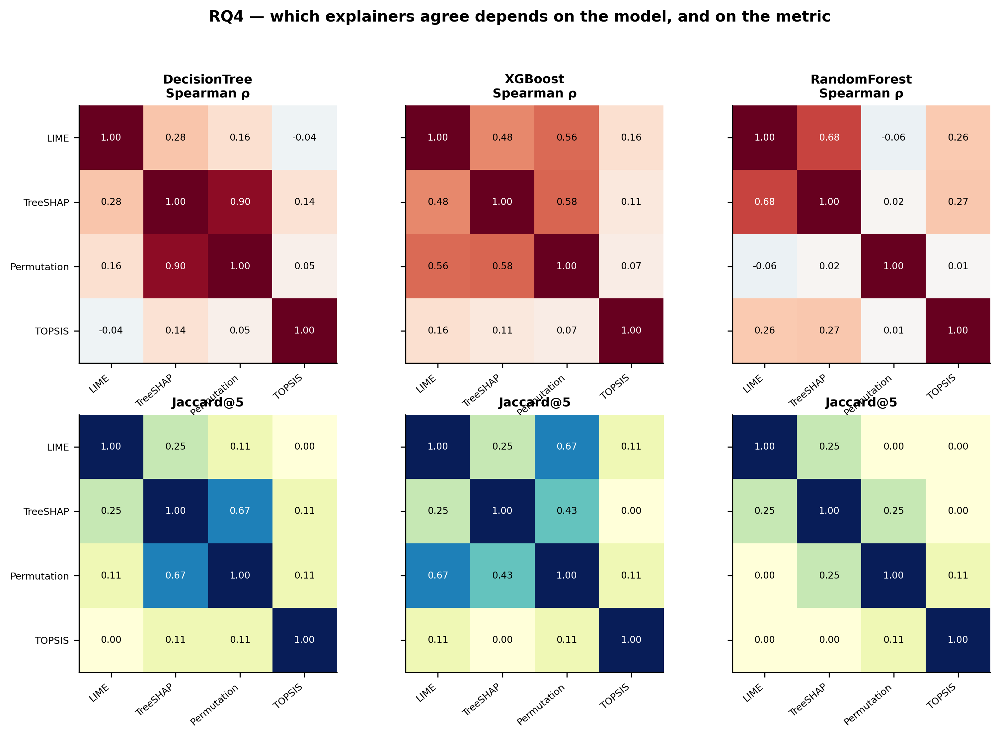

**What it shows.** Two rows per model: Spearman ρ over the full 39-feature
ranking (red–blue, −1 to 1) and Jaccard@5 top-set overlap (yellow–blue, 0 to 1).

**The finding.** A different pair is closest in every model. LIME↔TreeSHAP is
strongest on RandomForest (0.676); TreeSHAP↔Permutation on DecisionTree
(0.896); LIME↔Permutation on XGBoost (0.563). Agreement is a property of the
model being explained, not of the explainers.

**Why both rows exist.** They disagree. On RandomForest LIME and TreeSHAP
correlate at ρ = 0.676 yet share only 2 of their top 5. Permutation importance
has 18 of 39 features inside its own noise floor, so rank correlation over its
full ordering is partly correlating noise. **Report a set-overlap measure and a
rank-correlation measure, always.**

### Figure 4.11 — Computational cost

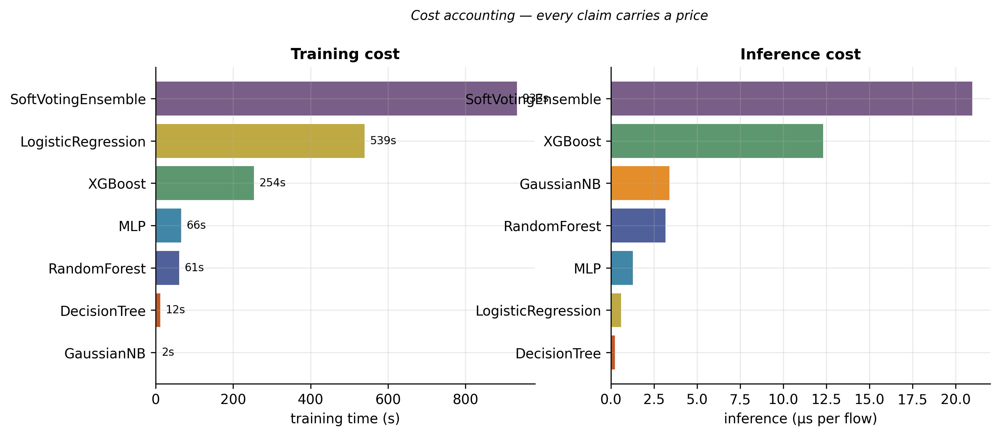

**What it shows.** Training time and per-flow inference latency by model.

**Why a results chapter needs this.** Every claim carries a price. XGBoost's
0.012 ms per flow versus DecisionTree's 0.0002 ms is a 50× gap for 3.4 points
of macro-F1. And at roughly 0.1 s per LIME explanation, a SOC handling
thousands of alerts an hour cannot explain them in real time — an operational
finding, not an implementation footnote.

---

## Inserting into the Word template

1. Insert the **PNG** (Word handles PDF poorly).
2. Apply the IIUC caption style **`15a Caption-Center`** below the figure.
3. Use **References → Insert Caption** — never type figure numbers by hand, or
   they will drift as you reorder chapters.
4. Update the LIST OF ILLUSTRATIONS with References → Update Table.

Use the **PDF** versions if you switch to LaTeX; they scale without
pixellation.

## Numbering map

| Thesis | File |
|---|---|
| Figure 1.1 | `fig_1_1_trust_gap` |
| Figure 2.1 | `fig_2_1_prior_art_positioning` |
| Figure 3.1 | `fig_3_1_system_architecture` |
| Figure 3.2 | `fig_3_2_rq1_protocol` |
| Figure 3.3 | `fig_3_3_rq2_protocol` |
| Figure 3.4 | `fig_3_4_experimental_design` |
| Figure 3.5 | `fig_3_5_preprocessing_pipeline` |
| Figure 4.1 | `01_class_distribution` |
| Figure 4.2 | `02_detection_performance` |
| Figure 4.3 | `03_per_class_performance` |
| Figure 4.4 | `04_rq1_stability_by_model` |
| Figure 4.5 | `05_rq1_class_heatmap` |
| Figure 4.6 | `06_rq1_falsified_mechanisms` |
| Figure 4.7 | `07_rq2_faithfulness_curves` |
| Figure 4.8 | `08_rq2_ratio_vs_random` |
| Figure 4.9 | `09_stability_vs_faithfulness` |
| Figure 4.10 | `10_rq4_agreement_heatmaps` |
| Figure 4.11 | `11_computational_cost` |
